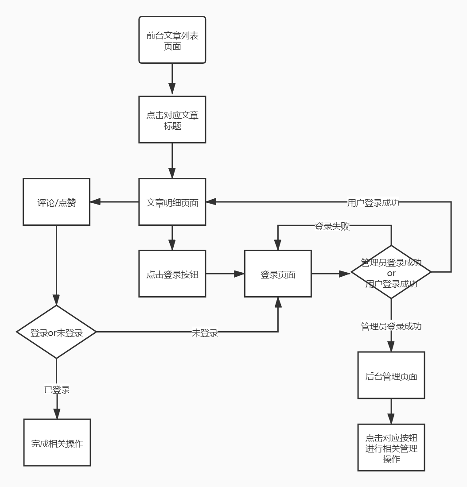

## 启动项目

cd toutiao-website

npm install

npm start

访问localhost：3000

## 基本目录结构

root/
	design/
			(数据字典、接口文档等相关文档)
	toutiao-service/
			（轻服务接口文档）

​	toutiao-website（前台站点项目）/
​				src/
​					components/
​							(前端页面相关组件)

​					index.js（前端站点应用入口）

## 成员分工

李秋作：

​	程序流程图

​	后台文章管理相关组件

​	前台文章列表组件

​	文章明细组件一部分

王莹：

## 加分项完成情况

1、在文章详情页面下实现评论功能，展示当前评论，以及通过输入框发表评论

2、在文章详情页面实现点赞功能

## 操作说明

## 问题及待完善

1、列表数据从请求得到前会显示nodata

2、组件间的通信及状态管理可以使用redux来管理

3、ui界面可以美化

4、后台管理页面可以直接通过url进入